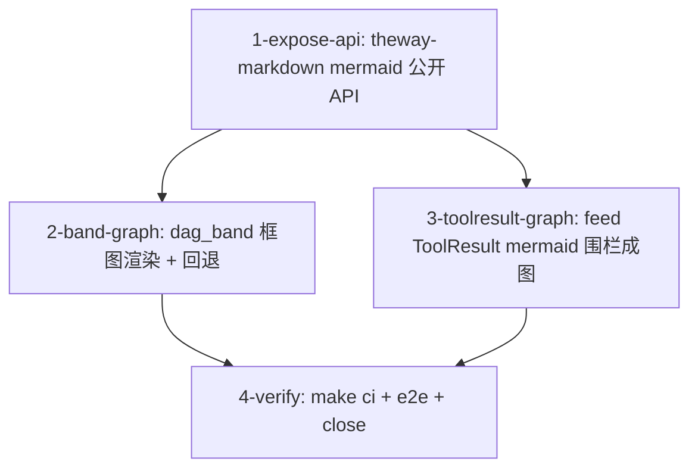

# Tasks



- [ ] 1-expose-api — `crates/theway-markdown/src/mermaid.rs` + `lib.rs`：
  - `MermaidStyles` / `MermaidArt` 转 `pub`（字段保持 pub），
    `MermaidStyles` 加 `Default`；`render()` 转 `pub fn render_mermaid_art
    (src, styles, max_width) -> Option<MermaidArt>`（原 `pub(crate)` 用法
    同步改名或加别名）。
  - lib.rs 导出 `pub mod mermaid` 或所需符号（命名避免与 parse 冲突）。
  - 验收：`cargo test -p theway-markdown` 全绿（现有 ~4900 行渲染器测试
    不动，只改可见性）；`cargo check` 无 dead_code 告警。
- [ ] 2-band-graph — `crates/theway-tui/src/ui/dag_band.rs`（+ `ui/mod.rs`
  仅调用点若有签名变化）：
  - 新增 `synthesize_mermaid(run) -> String`：`graph {run.direction}`
    + 每节点 `id["{status_glyph} {id}"]`（标签超过渲染器 MAX_LABEL 的
    截断策略：截 id）+ depends_on 边；goal-kind run（单节点自环）同样
    处理或直接单盒。
  - `render_dag_band`：每个 run 先试 `render_mermaid_art(src, styles,
    Some(band_width))`；成功（非 fallback 且行数 ≤ 高度预算）→ 画框图
    （行截断到 band 宽）；否则回退现有文本节点行。header 行与 `… N more`
    逻辑不变。
  - `band_rows` 同步按框图高度计算。
  - 验收：`cargo test -p theway-tui` 全绿（dag_band 现有测试 + 新增
    合成源码 / 回退分支测试）；dag 运行中 tmux 可见盒子 + 箭头。
- [ ] 3-toolresult-graph — `crates/theway-tui/src/feed_render.rs`：
  - ToolResult 展开分支（`tools_expanded`）里检测 ` ```mermaid` 围栏
    （逐行扫描 fence 起止），围栏内容经 `push_markdown`（或等价 mermaid
    渲染入口）输出框图行，非围栏行保持现状；折叠预览（preview）不渲染图。
  - 注意与现有 ToolResult 测试（1011/1036/1056 行附近）的兼容。
  - 验收：`cargo test -p theway-tui` 全绿；新增"tool result 含 mermaid
    围栏 → 框图"单测（`┌─┐` 盒子断言，复用 feed mermaid 测试风格）。
- [ ] 4-verify — `make check` + `make test`（workspace 全量）+ `make lint` +
  `make fmt-check`；tmux e2e：启动一个 dag run → 状态带框图渲染 + 状态符号
  随节点状态变化、dag_status 输出围栏在 feed 成图、超宽图回退、无 run 无
  变化；`gh issue close 41`。
