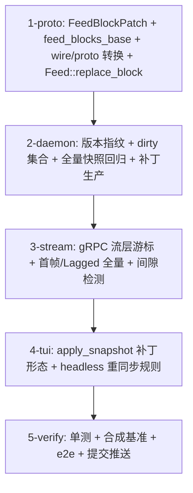

# Tasks

- `1-proto` — `proto/theway_grpc.proto`（FeedBlockPatch、feed_blocks_base=18、
  feed_block_patches=19）、`theway-transport` wire.rs（WireFeedBlockPatch、
  WireStatus.feed_block_patches/feed_block_base、feed_lines_base 恒 0 语义注释）、
  proto.rs 转换、feed/model.rs `replace_block` + 单测、既有 fixture 更新。
- `2-daemon` — `turn/daemon.rs`：`block_versions`/`dirty_blocks`/`patches_out` 状态，
  `apply_feed_update` 按事件表标脏，`wire_snapshot` 补丁生产（发布路径），
  `feed_lines_base` 回归 0；daemon 侧单测（追加/替换/clear/回填四类补丁）。
- `3-stream` — `theway-transport/src/grpc.rs`：`StreamCursor`（lines/blocks 双游标 +
  first_frame），Lagged → 全量重同步帧，base 漂移 → 全量，行尾部切片按流游标；
  transport 单测（首帧全量/正常增量/Lagged 全量/clear 收缩全量）。
- `4-tui` — `ui/mod.rs`：`apply_snapshot` 全量/补丁双形态（删除前缀 memcmp），
  resync_pending 走现有 get_state 路径；headless 打印器重同步规则；ui/tests.rs 增补
  补丁应用 + 间隙用例。
- `5-verify` — `make check` + workspace 全量测试 + clippy `-D warnings` + fmt；
  合成基准（10k 块 no-change/streaming/backfill 帧成本）；tmux e2e（长会话流式 CPU、
  headless 重连、JSON 状态面完整性）；按 crate 提交推送；close #36。
