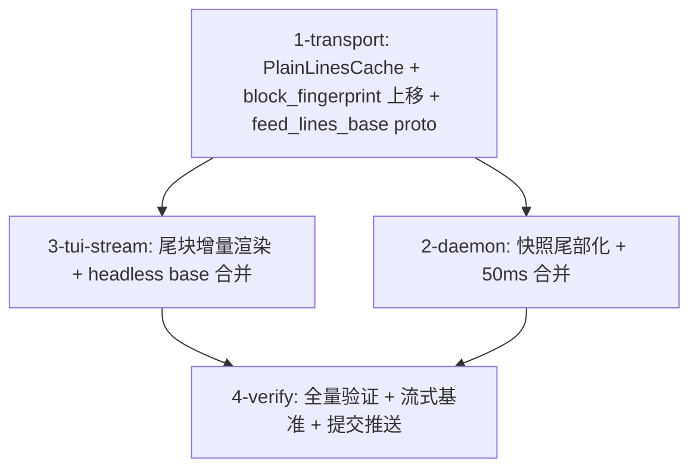

# Tasks

- `1-transport` — `theway-transport/src/feed/plain_cache.rs`（缓存 + 指纹，含单测）、
  `feed/model.rs`、`proto.rs`/`wire.rs`、`proto/theway_grpc.proto`、测试 fixture 更新。
- `2-daemon` — `turn/daemon.rs`（PlainLinesCache 接入 + 发布合并）。
- `3-tui-stream` — `feed_render.rs`（逐行 markdown 处理器抽取 + IncrementalWrap）、
  `feed_cache.rs`（流式状态机）、`ui/mod.rs`（headless base 合并）。
- `4-verify` — 全量 check/test/clippy、流式增量 vs 一次性基准对比、tmux 实测、提交推送、close #35。
