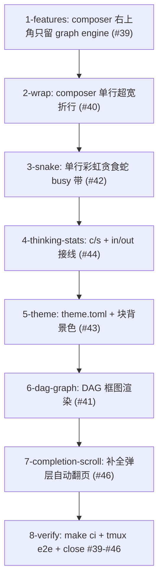

# Tasks



全串行：ui/mod.rs 被 1/2/3/4/5/7 修改，feed_render.rs 被 4/5/6 修改，
按仓库规则共享文件节点串行。每节点小步 commit（feat(#子issue)），
8-verify 基于最新 HEAD 复核并逐条 close。

- [ ] 1-features — `crates/theway-tui/src/ui/mod.rs` + `ui/tests.rs`：
  - `feature_labels(runtime, dags, has_goal)` → `feature_labels(dags)`：
    删 runtime 透传与 goal 推导；dag-kind run 存在 → `["graph engine"]`，
    否则空。调用点只传 `&self.latest.dags`。
  - 测试：删 `feature_labels_passes_runtime_features_through` /
    `feature_labels_goal_from_run_or_active_goal_once` /
    `feature_labels_combined_order`；`chrome_top_divider_shows_feature_labels`
    fixture 去 runtime/goal 只留 dags。
  - 验收：`cargo check -p theway-tui`；`cargo test -p theway-tui` 全绿；
    trigger 面板 Runtime 区块不受影响（测试未删）。
- [ ] 2-wrap — `crates/theway-tui/src/ui/mod.rs` + `ui/tests.rs`：
  - `composer_rows(input_area_width: u16)`：拖拽覆盖优先；否则
    `content_width = input_area_width.saturating_sub(5)`，
    `rows = self.input.desired_height(content_width)`；`rows > 6` 时用
    `content_width - 1` 复核（scrollbar 预留），clamp 1..=6；render 调用点
    传 `frame.area().width`。
  - 测试：超宽单行（200 字符）`composer_rows` ≥ 2 且 ≤ 6；超长封顶 6；
    `input_is_single_line()` 仍 true；拖拽覆盖优先。
  - 验收：`cargo check -p theway-tui`；`cargo test -p theway-tui` 全绿。
- [ ] 3-snake — 新 `crates/theway-tui/src/ui/snake_loader.rs` +
  `ui/mod.rs` + `ui/tests.rs`：
  - `snake_frame(step, cps) -> SnakeFrame`（轨道固定 9 格；蛇头三角波
    0→8→0 折返；蛇尾节 i 跟随头历史位置、越界暗色；lit 随 trail 衰减，
    trail 2→8 随 cps；色相 `step*15° + i*40°` 经 hsv_to_rgb；字形 `●`）。
  - pixel_loader.rs：`hsv_to_rgb` 转 `pub(crate)`。
  - ui/mod.rs：删 BUSY_STATUS_ROWS（status 恒 1 行）；render_busy_status
    单行——蛇轨道 x+1 起 9 格、标签 x+12 起、stats 右对齐同行。
  - 测试：蛇折返轨迹 / 蛇尾跟随与翻面 / 彩虹渐变 / trail 封顶 / 暗色
    轨道点恒在；`busy_status_shows_pixel_loader_with_elapsed` 改 1 行带
    断言（composer 顶边框 = 标签行 + 1）。
  - 验收：`cargo check -p theway-tui`；`cargo test -p theway-tui` 全绿；
    dag band mini spinner 测试不回归。
- [ ] 4-thinking-stats — `ui/mod.rs` + `feed_render.rs` + `feed_cache.rs` +
  `ui/tests.rs`：
  - ui/mod.rs 组装 opts：`thinking_cps = self.cps_meter.cps()`；
    `thinking_input_tokens` / `thinking_output_tokens` =
    `latest.usage.input_tokens/output_tokens`（>0 才有效）。
  - feed_render.rs：`FeedRenderOptions` 加 `thinking_input_tokens`；
    `thinking_stats_line` 右侧 `c/s: N · in: X · out: Y`；**手写 PartialEq**
    只比较 thinking_mode / tools_expanded / 主题色（cps/in/out/
    spinner_phase 不参与，防 feed_cache 每帧失效）。
  - feed_cache.rs：无改动（stats 行 rebuild 路径已在，新值随流式生效）；
    跑现有测试确认增量语义不回归。
  - 测试：thinking_stats_line 格式断言（in/out 出现）；opts 相等语义
    测试（cps 变化仍相等、mode 变化不等）。
  - 验收：`cargo check -p theway-tui`；`cargo test -p theway-tui` 全绿。
- [ ] 5-theme — 新 `crates/theway-tui/src/theme.rs` + `feed_render.rs` +
  `ui/mod.rs` + `ui/tests.rs`：
  - `Theme`（角色字段 + Default = 现状 const 色）+ `Theme::load`
    （`[colors]` 表解析；未知角色忽略、非法 hex warn 回落、无文件默认）。
  - feed_render.rs：const 迁为默认值来源；FeedRenderOptions 加主题色
    字段（结构，参与 PartialEq）；Tool 块（标题+args）、ToolResult
    （展开/预览）、Thinking（Full/Peek + stats 行）设背景且**铺满块行宽**
    （文本宽度归一后补 bg span 至 width，空行纯 bg）。
  - ui/mod.rs：启动 `Theme::load(~/.theway/theme.toml)` 一次存
    `App.theme`，组装 opts 填入。
  - 测试：Theme 解析（默认/覆盖/未知/非法/缺失）；自定义主题下 tool /
    thinking 块 buffer bg 断言；默认主题 feed_render 现有测试全绿。
  - 验收：`cargo check -p theway-tui`；`cargo test -p theway-tui` 全绿。
- [ ] 6-dag-graph — `crates/theway-markdown` + `ui/dag_band.rs` +
  `ui/feed_render.rs`：
  - markdown：`mermaid.rs` 的 `MermaidStyles`/`MermaidArt` 转 `pub`、
    `MermaidStyles` 加 Default、`render()` 转 `pub render_mermaid_art`；
    lib.rs 导出。
  - dag_band.rs：`synthesize_mermaid(run)`（`graph {direction}` +
    `id["{glyph} {id}"]` + depends_on 边）；render 每 run 先试
    `render_mermaid_art(.., Some(band_w))`，成功且行数 ≤ 高度预算画框图，
    否则回退文本行；`band_rows` 按框图高度计；header / `… N more` 不变。
  - feed_render.rs：ToolResult 展开分支检测 ```mermaid 围栏（逐行扫
    fence 起止）→ 复用 markdown mermaid 渲染路径成图，非围栏行现状。
  - 测试：合成源码快照；回退分支；band_rows 框图高度；tool result 含
    mermaid 围栏 → `┌─┐` 盒子断言。
  - 验收：`cargo check --workspace`；`cargo test -p theway-markdown -p
    theway-tui` 全绿。
- [ ] 7-completion-scroll — `ui/mod.rs` + `ui/app_input.rs` + `ui/tests.rs`：
  - `App` 加 `completion_scroll: usize`；`completion_prev` / `completion_next`
    / `cycle_completion` 移动后调整窗口：idx < scroll → scroll = idx；
    idx ≥ scroll + COMPLETION_POPUP_MAX → scroll = idx - MAX + 1。
  - `render_completions`：渲染 `completions[scroll..scroll+MAX]`，高亮按
    绝对下标匹配（`i == scroll 偏移`）。
  - `refresh_completions` / `clear_input` / `accept_completion` 重置
    scroll = 0；Up/Down/Tab 环绕不变。
  - 测试：20+ 项列表 Down 连按越过 8 项后高亮仍在窗口内（buffer 断言
    高亮行可见）；Up 回翻跟随；刷新重置到顶部。
  - 验收：`cargo check -p theway-tui`；`cargo test -p theway-tui` 全绿。
- [ ] 8-verify — `make check` + `make test`（workspace 全量）+ `make lint` +
  `make fmt-check`；tmux e2e 逐条：①composer 右上角仅 graph engine（无
  dag run 无标签，trigger 面板 Runtime 仍在）②长文本折行显示行首 + Up/Down
  历史/拖拽调高回归 ③busy 时彩虹蛇在 9 点轨道左右跑 + 折返 + 与 working
  同行（带 1 行、idle 无跳动）④流式 thinking 统计行 c/s 非零 + in/out
  随流更新 ⑤theme.toml 定制 tool/thinking 背景铺满块宽 + 无主题视觉回归
  ⑥dag 状态带盒子+箭头图 + dag_status mermaid 围栏在 feed 成图 + 超宽
  回退 ⑦补全弹层 Down/Up 越界自动翻页、高亮始终可见；
  `gh issue close 39 40 41 42 43 44 46`，证据贴 #45 后 `gh issue
  close 45`。
