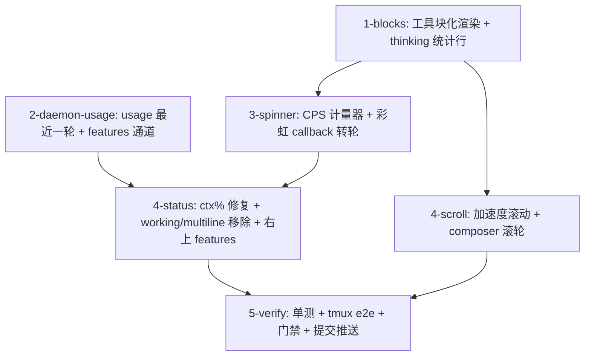

# Tasks

- `1-blocks` — `feed_render.rs`：tool call 块化（首行指令 + 5 行 result 预览 +
  省略行，`tools_expanded` 保持全量；解决 #33 遗留"工具调用平铺"）；thinking 块头部
  统计行（字数 + c/s + output，human 格式 1 位小数）；单测。
- `2-daemon-usage` — `turn/daemon.rs`：wire_snapshot usage 改「最近一轮」（最后
  一条 assistant 消息的 usage，不再会话累计；解决 #33 遗留 ctx 恒 100%）；features
  标签通道（从 sidebar runtime/配置推导 `graph engine` / `goal` 等）；daemon 单测。
- `3-spinner` — `ui/stats.rs` CpsMeter（1s 滑动窗）+ `pixel_loader.rs` rainbow
  callback 化（`advance(cps)` 速度映射 + 20ms 封顶 + 回落基准）；busy 带接入
  char/s + input/output 统计；thinking 块迷你转轮；dag subagents 指示器统一
  组件；单测（cps 滑窗、速度映射单调封顶）。
- `4-status` — `ui/mod.rs` + `prompt_chrome.rs`：ctx% 用最近一轮 usage；移除
  working/multiline 标志；右上角 features 标签渲染；ui/tests.rs 增补。
- `4-scroll` — `ui/mod.rs` + `app_input.rs`：键盘滚动加速度（repeat 计数驱动
  `mult = min(1.0 + repeat*0.1, 1.5)`，方向切换/Release 复位；滚轮保持原步长）；
  composer 滚轮浏览（鼠标在 text_area 时滚轮事件转发给 textarea.input()，
  feed 区域才滚 feed）；单测（mult 序列封顶、滚轮区域路由）。
- `5-verify` — `make check` + `make test` + `make lint` + `make fmt-check`；
  tmux e2e（块折叠视觉、流式 c/s 与转轮加速、工具等待回落、ctx% 变化、长按加速
  滚动、composer 滚轮、拖拽调高回归）；选区保持现有高亮不动；按 crate 提交
  推送；close issue。
