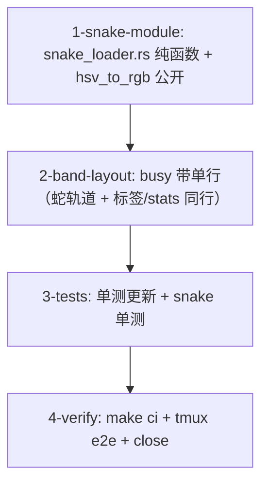

# Tasks

- [ ] 1-snake-module — 新 `crates/theway-tui/src/ui/snake_loader.rs`
  （mod.rs 注册 `mod snake_loader;`）：
  - `snake_frame(step, cps) -> SnakeFrame`：轨道固定 9 格（索引 0..=8）；
    蛇头位置 = step 的三角波（周期 `2*8=16`，`0→8→0` 折返，确定性）；
    运动方向 = 三角波导数的符号。
  - 蛇尾节 i（1..=8）：右行时在 `head - i`、左行时在 `head + i`；越界即
    不点亮（暗色轨道底）；亮度 `lit = max(0, 1 - i/trail)`，`trail` 随
    cps 从 2 增长到 8（复用 pixel_loader trail 语义，封顶 8）。
  - 彩虹：色相 = `step*HUE_STEP_DEG + i*HUE_TRAIL_OFFSET_DEG`，经
    `hsv_to_rgb`；蛇头 lit=1 + BOLD 由调用方决定（模块返回 lit 值）。
  - 字形 `●`（U+25CF），未点亮轨道点 `fg = DarkGray`（9 个点始终可见）。
  - `pixel_loader.rs`：`hsv_to_rgb` 改 `pub(crate)`。
  - 验收：`cargo check -p theway-tui`；纯函数无状态（step 输入 frame
    输出，与 pixel_loader 同风格）。
- [ ] 2-band-layout — `crates/theway-tui/src/ui/mod.rs`：
  - 删除 `BUSY_STATUS_ROWS`；render() 的 status 约束恒为
    `Constraint::Length(1)`（busy/idle 同高，无布局跳动）。
  - `render_busy_status` 重写为单行：蛇轨道画在 `area.x + 1`（9 格），
    working 标签/elapsed/队列/↑scrolled 从蛇后 2 格起（x+12），
    `render_busy_stats` 右对齐同行；删除 3×3 网格绘制循环。
  - `shimmer_style` / `elapsed_label` 不动。
  - 验收：`cargo check -p theway-tui`；busy 带 1 行布局正确。
- [ ] 3-tests — `crates/theway-tui/src/ui/tests.rs` + snake_loader 单测：
  - 更新 `busy_status_shows_pixel_loader_with_elapsed`：断言 1 行带
    （composer 顶边框 = label 行 + 1）、`●` 蛇点存在、working/elapsed/
    queue 仍在。
  - snake_loader 单测：三角波折返（连续步头位置轨迹 0→8→0 对称）、
    蛇尾跟随头轨迹且方向正确（右行在左、左行在右）、折返瞬间蛇尾翻面、
    彩虹渐变（相邻节色相不同、颜色随 step 推进）、trail 随 cps 增长且
    封顶 8、未点亮轨道点恒在（9 个 `●`/暗色点）。
  - 验收：`cargo test -p theway-tui` 全绿；dag band mini spinner 测试
    不受影响。
- [ ] 4-verify — `make check` + `make test`（workspace 全量）+ `make lint` +
  `make fmt-check`；tmux e2e：busy 时彩虹蛇在 9 点轨道左右跑动 + 折返、
  busy 带 1 行（与 idle 同高、无跳动）、dag band mini spinner 回归；
  `gh issue close 42`。
