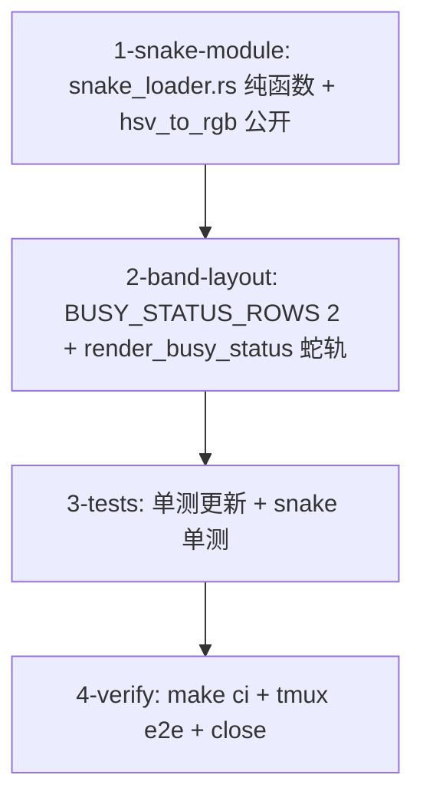

# Tasks

- [ ] 1-snake-module — 新 `crates/theway-tui/src/ui/snake_loader.rs`
  （mod.rs 注册 `mod snake_loader;`）：
  - `snake_frame(step, cps, track_width) -> SnakeFrame`：蛇头位置 =
    step 在轨道上的三角波（`(2*len)` 周期折返，跑到行尾反弹）；蛇身节 i
    跟随蛇头第 i 步前的位置（越界即不画）；方向字形 `▸`/`◂`，蛇身 `■`。
  - 彩虹：色相 = `step*HUE_STEP_DEG + i*HUE_TRAIL_OFFSET_DEG`，亮度从
    头到尾衰减（尾节最暗）；头 lit=1。
  - `track_width < SNAKE_LEN` 时蛇头折返周期按实际可用宽度钳制（不越界）。
  - `pixel_loader.rs`：`hsv_to_rgb` 改 `pub(crate)`；常量
    `HUE_STEP_DEG`/`HUE_TRAIL_OFFSET_DEG` 引用。
  - 验收：`cargo check -p theway-tui`；模块纯函数无状态（step 输入
    frame 输出，与 pixel_loader 同风格）。
- [ ] 2-band-layout — `crates/theway-tui/src/ui/mod.rs`：
  - `BUSY_STATUS_ROWS` 3 → 2；`render_busy_status`：蛇轨画在
    `area.y`（满宽），working 标签/elapsed/队列/↑scrolled 移到
    `area.y + 1`（起点 x+1），`render_busy_stats` 仍画 `area.y + 1` 右侧。
  - 删除 3×3 网格绘制循环（rainbow_frame 的 busy 用法）。
  - 验收：`cargo check -p theway-tui`；busy 带 2 行布局正确。
- [ ] 3-tests — `crates/theway-tui/src/ui/tests.rs` + snake_loader 单测：
  - 更新 `busy_status_shows_pixel_loader_with_elapsed`：断言 2 行带
    （composer 顶边框 = label 行 + 1）、蛇头/蛇身 glyph 存在、
    working/elapsed/queue 仍在。
  - snake_loader 单测：三角波折返（连续步头位置轨迹对称）、蛇身跟随头
    轨迹、方向字形随折返翻转、彩虹渐变（相邻节色相不同、颜色随 step
    推进）、窄轨道宽度钳制、步进语义与 pixel_loader 测试风格一致。
  - 验收：`cargo test -p theway-tui` 全绿；`cargo test -p theway-pager-render`
    等不受影响。
- [ ] 4-verify — `make check` + `make test`（workspace 全量）+ `make lint` +
  `make fmt-check`；tmux e2e：busy 时彩虹蛇左右跑动 + 折返、busy 带 2 行、
  idle 带 1 行回归、dag band mini spinner 回归；`gh issue close 42`。
