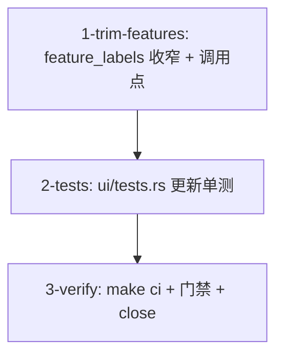

# Tasks

- [ ] 1-trim-features — `crates/theway-tui/src/ui/mod.rs`：
  - `feature_labels(runtime, dags, has_goal)` → `feature_labels(dags)`：
    删除 `runtime.to_vec()` 透传与 `goal` 推导分支；dag-kind run 存在时返回
    `vec!["graph engine"]`，否则空。
  - render() 调用点改为只传 `&self.latest.dags`（去掉 `sidebar.runtime` 与
    `has_goal` 实参）。
  - 验收：`cargo check -p theway-tui`；函数只剩一个 dag-kind 分支。
- [ ] 2-tests — `crates/theway-tui/src/ui/tests.rs`：
  - 删除 `feature_labels_passes_runtime_features_through`、
    `feature_labels_goal_from_run_or_active_goal_once`、
    `feature_labels_combined_order`。
  - 保留并收窄 `feature_labels_empty_without_sources`（无 dag run 返回空）与
    `feature_labels_derives_graph_engine_from_dag_run`（dag-kind run 返回
    `["graph engine"]`）。
  - `chrome_top_divider_shows_feature_labels` fixture 去掉 `status.sidebar.runtime`
    与 `status.goal` 设置，只留 `dags`（断言分隔线只有 `graph engine`）。
  - 验收：`cargo test -p theway-tui` 全绿。
- [ ] 3-verify — `make check` + `make test`（workspace 全量）+ `make lint` +
  `make fmt-check`；tmux e2e：composer 右上角无 dag run 时无标签、运行 dag 时
  只显示 `graph engine`、trigger 面板 Runtime 区块仍列出 dedup/cycle
  suppress 等；`gh issue close 39`。
