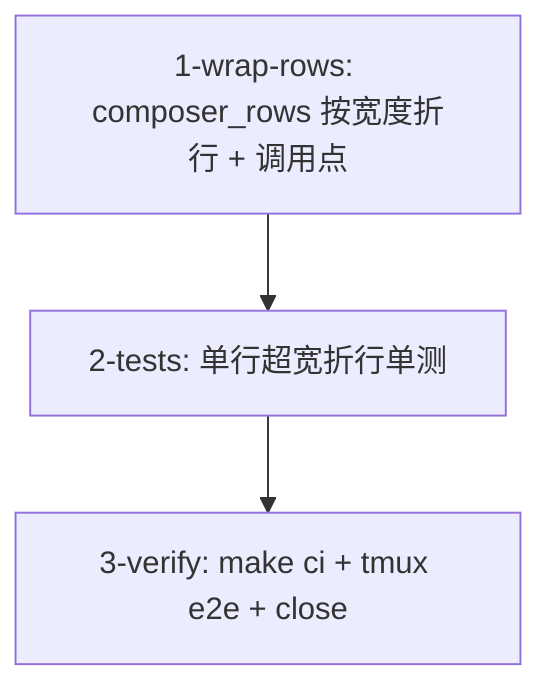

# Tasks

- [ ] 1-wrap-rows — `crates/theway-tui/src/ui/mod.rs`：
  - `composer_rows()` → `composer_rows(input_area_width: u16)`：拖拽覆盖优先；
    否则 `content_width = input_area_width.saturating_sub(5)`（PAD_LEFT 2 +
    PAD_RIGHT 1 + PREFIX 2），`rows = self.input.desired_height(content_width)`；
    若 `rows > MAX_INPUT_ROWS` 则用 `content_width.saturating_sub(1)` 复核
    （scrollbar 预留 1 列），最终 clamp `1..MAX_INPUT_ROWS`。
  - render() 调用点传 `frame.area().width`（input 区占满行宽）。
  - `input_display_lines()` 不动，注释说明其职责（逻辑行数）。
  - 验收：`cargo check -p theway-tui`；单行超宽文本 composer 长到 6 行封顶。
- [ ] 2-tests — `crates/theway-tui/src/ui/tests.rs`：
  - 单行超宽草稿：apply_snapshot 后构造 200 字符无 `\n` 输入，断言
    `composer_rows` ≥ 2 且 ≤ 6；6 行封顶场景（超长文本）断言 = 6。
  - 折行不影响 `input_is_single_line()`（超宽单行仍返回 true → Up/Down 走
    历史分支）。
  - 拖拽覆盖优先：`manual_composer_rows = Some(1)` 时 `composer_rows` = 1。
  - 验收：`cargo test -p theway-tui` 全绿。
- [ ] 3-verify — `make check` + `make test`（workspace 全量）+ `make lint` +
  `make fmt-check`；tmux e2e：长文本折行显示行首、Up/Down 历史、拖拽调高、
  多行草稿回归；`gh issue close 40`。
