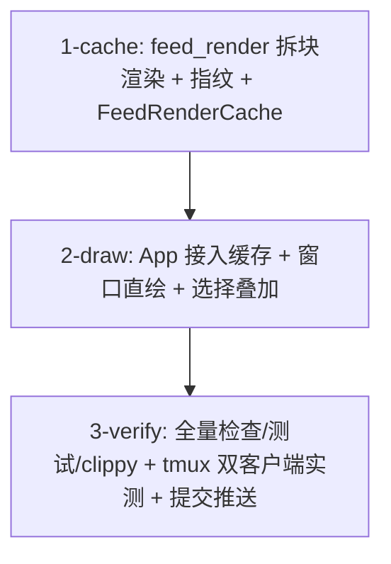

# Tasks

- `1-cache` — `crates/theway-tui/src/feed_render.rs`（拆 `render_block` / `block_fingerprint` /
  `render_lines_window`）、新增 `crates/theway-tui/src/feed_cache.rs`（缓存 + 单元测试）。
- `2-draw` — `crates/theway-tui/src/ui/mod.rs`（`render()` 接入缓存、窗口直绘、选择叠加、
  移除 `trim_feed_head`）、`src/main.rs`（模块声明）、`ui/tests.rs`（既有渲染测试保持绿）。
- `3-verify` — `make check`、workspace 测试、`clippy -D warnings`、fmt、tmux 双客户端 + 流式输出
  实测 CPU、按 crate 提交推送、close #34。
