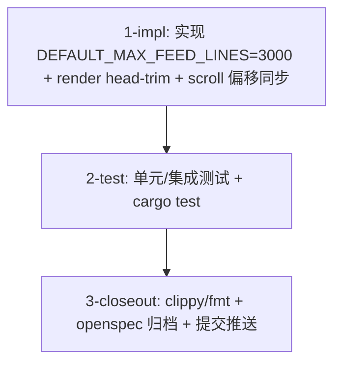

# Tasks — tui-feed-max-lines (issue #27)

- [ ] 1-impl: `ui/mod.rs` 加常量与 head-trim 逻辑（`trim_feed_head` 助手函数）
- [ ] 2-test: `ui/tests.rs` 补测试（裁剪数量/尾部保留/scroll 不跳变），跑 `cargo test -p theway-tui`
- [ ] 3-closeout: `cargo clippy` + `cargo fmt --check`，提交（Conventional Commits + `#27`）并推送 main
