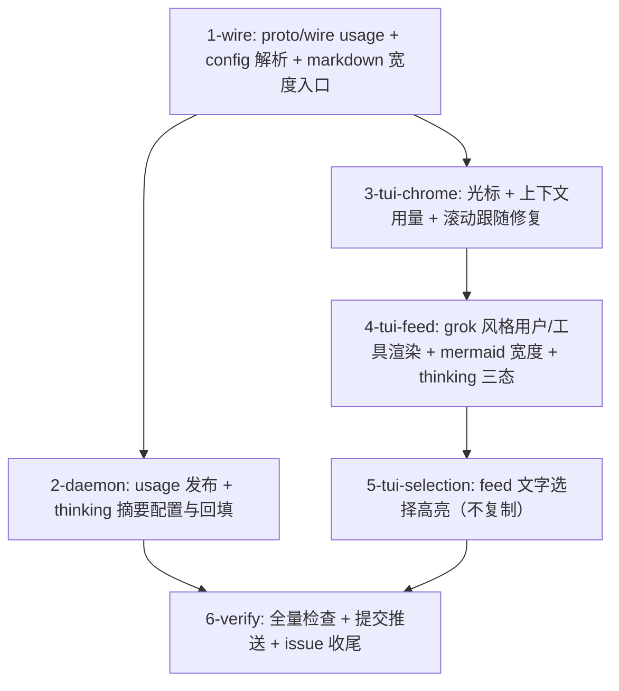

# Tasks

- `1-wire` — theway-transport proto.rs/wire.rs/config.rs、proto/theway_grpc.proto、theway-markdown lib.rs。
- `2-daemon` — theway-daemon turn/daemon.rs、bin/thewayd.rs、theway-transport feed model.rs/types.rs。
- `3-tui-chrome` — theway-tui ui/mod.rs、ui/prompt_chrome.rs。
- `4-tui-feed` — theway-tui feed_render.rs、ui/mod.rs、ui/app_input.rs。
- `5-tui-selection` — theway-tui ui/mod.rs、ui/app_input.rs。
- `6-verify` — 全 workspace check + 定向测试 + clippy；按 crate 分批提交；push main；close #33。
