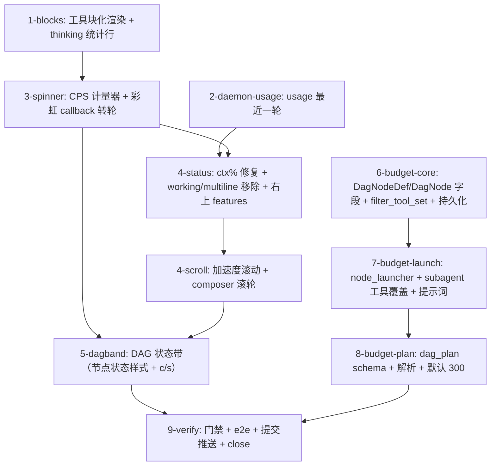

# Tasks

## TUI 链（issue #38 范围）

- [ ] 1-blocks — `feed_render.rs`：tool call 块化（首行指令 + 5 行 result 预览 +
  省略行，`tools_expanded` 保持全量；解决 #33 遗留"工具调用平铺"）；thinking 块头部
  统计行（字数 + c/s + output，human 格式 1 位小数）；FeedRenderOptions 加
  `thinking_cps`/`thinking_output_tokens`/`spinner_phase` 透传字段；单测。
- [ ] 2-daemon-usage — `turn/daemon.rs`：wire_snapshot usage 改「最近一轮」——取
  agent state 最后一条 assistant 消息的 usage（`AgentMessage::Llm(Message::Assistant
  (a))` 的 `a.usage`），替换会话累计 `cost.tokens`；daemon 单测。
- [ ] 3-spinner — `ui/stats.rs` CpsMeter（1s 滑动窗）+ `pixel_loader.rs` rainbow
  callback 化（`RainbowSpinner` + `step_delay_ms(cps)` 速度映射 + 20ms 封顶 +
  回落基准）；9 点点亮顺序按用户给定的旋转阵列落表（三张顺序表单测钉死，
  design §4.3；第三轮 ASCII 有错位，无法对齐时 ask_user）；busy 带接入
  char/s + input/output 统计；thinking 统计行接数值；单测（cps 滑窗、速度
  映射单调封顶、顺序表）。dag band 转轮复用本组件（5-dagband 接）。
- [ ] 4-status — `ui/mod.rs` + `prompt_chrome.rs`：ctx% 用最近一轮 usage；移除
  working/multiline 标志；右上角 features 标签（sidebar.runtime + dags kind 推导
  graph engine/goal，纯函数 `feature_labels`）；ui/tests.rs 增补。
- [ ] 4-scroll — `ui/mod.rs` + `app_input.rs`：键盘滚动加速度（repeat 计数驱动
  `mult = min(1.0 + repeat*0.1, 1.5)`，方向切换/Release 复位；滚轮保持原步长）；
  composer 滚轮浏览（鼠标在 text_area 时滚轮事件转发给 textarea.input()，
  feed 区域才滚 feed）；单测（mult 序列封顶、滚轮区域路由）。
- [ ] 5-dagband — 新 `ui/dag_band.rs`：DAG 状态带（`latest.dags` 非空时渲染在 feed
  与 busy 带之间）；run 头行（`dag-2 · name · 2/6 · c/s 84` + 运行中迷你转轮）；
  节点行状态符号/颜色（pending `·` / ready `▸` / running `▶` / succeeded `✓` /
  failed `✗` / cancelled `×` / skipped `↷`）；run 级 c/s（复用 CpsMeter，每 run
  实例，output_tokens 快照 delta 1s 窗）；`ui/mod.rs` 只加调用点；单测（状态
  样式、截断、c/s 计量）。

## 编排链（预算 + 工具 allowlist）

- [ ] 6-budget-core — `crates/theway-core`：
  - `multiagent/graph/types.rs`：`DagNodeDef` + `DagNode` 加
    `max_iterations: Option<u32>`（`#[serde(default)]`）与
    `tools: Option<Vec<String>>`（`#[serde(default)]`）。
  - `multiagent/graph/model/mod.rs` `build_run()`：Def → Node 传递。
  - `multiagent/graph/persist.rs`：`PersistedNode` 镜像字段（serde default）+
    snapshot/hydrate 拷贝。
  - `multiagent/graph/model/mermaid.rs`：构造处补 `None`。
  - `multiagent/runner.rs`：`pub fn filter_tool_set(tools, allow) -> Result<…, String>`
    （空 allow 全量；未知名 Err 列可用名；按原顺序过滤）。
  - 单测：filter_tool_set 四态、build_run 传递、persist roundtrip。
- [ ] 7-budget-launch — `crates/theway-core/src/multiagent/graph/node_launcher.rs`：
  `launch()` 里读取 `node.max_iterations` 覆盖 `launch.max_iterations`；读取
  `node.tools` 过滤工具集（filter 失败 → `on_node_completed` 失败节点，附错误）；
  `crates/theway-daemon/src/tools/subagent.rs`：execute 里同模式覆盖 + 过滤
  （Err → `AgentToolError::Message`）；两个工具的 description/schema 加
  `max_iterations`/`tools` 参数与预算/工具策略说明（短平快 4–32、默认 300、
  allowlist 未知即失败）。
- [ ] 8-budget-plan — `crates/theway-daemon/src/tools/dag_tools/{plan,utils}.rs`：
  PLAN_DEFINITION description 节点字段加 `maxIterations?`/`tools?` + 两段策略
  说明；schema 加 `maxIterations`（number）与 `tools`（array of string）；
  `node_def_from_json` 解析两字段；`crates/theway-daemon/src/agent_specs.rs`：
  `DEFAULT_MAX_ITERATIONS` 16 → 300（注释：code-harness 预算；短平快任务由
  orchestrator 降；goal-evaluator 保持 1）。
- [ ] 9-verify — `make check` + `make test`（workspace 全量）+ `make lint` +
  `make fmt-check`；tmux e2e（块折叠视觉、流式 c/s 与转轮加速、工具等待回落、
  ctx% 变化、长按加速滚动、composer 滚轮、拖拽调高回归、dag 状态带渲染）；
  编排 e2e（可选：`tools: ["bash"]` 节点工具面收窄、`maxIterations: 8` 短任务
  正常完成）；#37 台账回归（proposal 台账 7 条，tmux）：slash 弹层 Up/Down
  选择 + Enter 接受、未匹配 slash（路径）回落 user message 无报错、chrome 无
  theway 品牌 + info 行 `provider:model-id`、`/reload` 重扫 + 多根 skills 去重
  （`.agents` 优先、先到者胜）、paste object backspace 整体删除、拖拽调高 +
  发送复位、鼠标左键拖拽选区（用户反馈仍失效——回归失败即修，改动限
  ui/mod.rs 选区路径）；按 crate 提交推送（feat(#38): …）；close issue #38。
