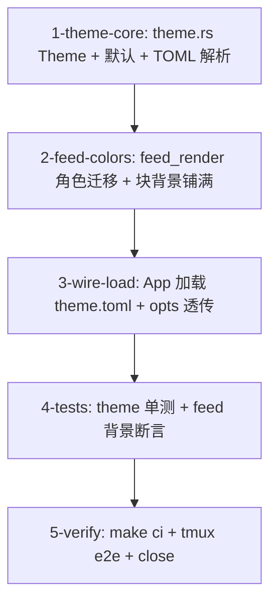

# Tasks

- [ ] 1-theme-core — 新 `crates/theway-tui/src/theme.rs`：
  - `Theme`：角色字段（`user_text`/`user_bg`/`assistant_text`/
    `assistant_prefix`/`tool_title`/`tool_args`/`tool_result`/`tool_error`/
    `tool_running_bg`/`tool_success_bg`/`tool_error_bg`/`thinking_text`/
    `thinking_bg`），默认值 = feed_render 现有 const 颜色。
  - `Theme::load(path) -> Result<Theme>`：解析 `[colors]` 表
    `role = "#rrggbb"`（接受 `#rgb`/`#rrggbb`，大小写不敏感）；未知角色
    忽略（warn）；非法 hex warn + 该键回落默认；无文件/空文件 → 默认。
  - 单测：default 值、合法覆盖、未知角色忽略、非法色回落、文件缺失。
  - 验收：`cargo check -p theway-tui`；`cargo test -p theway-tui theme`。
- [ ] 2-feed-colors — `crates/theway-tui/src/feed_render.rs`：
  - `FeedRenderOptions` 增加主题色字段（`#[derive(PartialEq)]` 已具备，
    feed_cache 指纹随之覆盖主题变化）。
  - 块渲染改读 opts 主题色：`Block::Tool`（标题行 + args）、
    `Block::ToolResult`（展开/预览）、`Block::Thinking`（stats 行 + Full
    段落 + Peek 行）设背景；背景铺满块行宽（行内文本宽度归一后补 bg
    span 至 width；空行仅 bg）。
  - 现有 const 保留为默认值来源（theme.rs 引用），调用点全部切到 opts。
  - 验收：`cargo check -p theway-tui`；`cargo test -p theway-tui` 全绿
    （现有 feed_render 测试在默认主题下不回归）。
- [ ] 3-wire-load — `crates/theway-tui/src/ui/mod.rs`（+ 入口）：
  - `App` 增 `theme: Theme`；TUI 启动时 `Theme::load(~/.theway/theme.toml)`
    一次（失败 warn 用默认）；`FeedRenderOptions` 组装处填入主题色。
  - `THEWAY_DIR` 语义复用现有 ~/.theway 路径解析。
  - 验收：`cargo check -p theway-tui`；运行无 theme.toml 正常启动。
- [ ] 4-tests — `crates/theway-tui/src/ui/tests.rs` + feed_render 测试：
  - `test_app()` 注入默认主题；自定义主题下 tool call 块 / thinking 块
    背景色断言（buffer cell bg 检查）。
  - theme.toml 解析测试（同 1 节点，若放 theme.rs 内联则此节点只做
    ui 层集成断言）。
  - 验收：`cargo test -p theway-tui` 全绿。
- [ ] 5-verify — `make check` + `make test`（workspace 全量）+ `make lint` +
  `make fmt-check`；tmux e2e：默认主题视觉回归（截图对比现状）、
  写 theme.toml（tool_success_bg=#34343e / tool_error_bg=#3c2828 /
  thinking_bg=#2c2c34）后工具块/thinking 块背景生效且铺满块宽；
  `gh issue close 43`。
